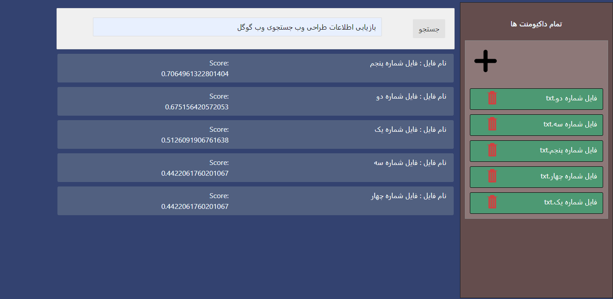
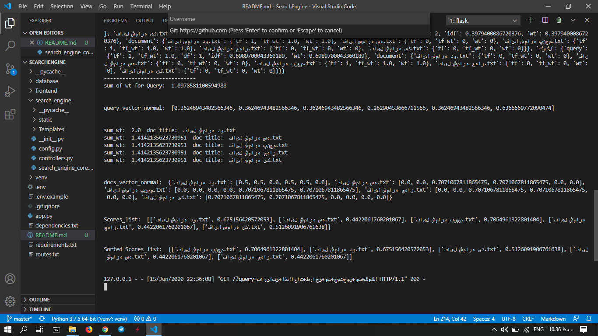
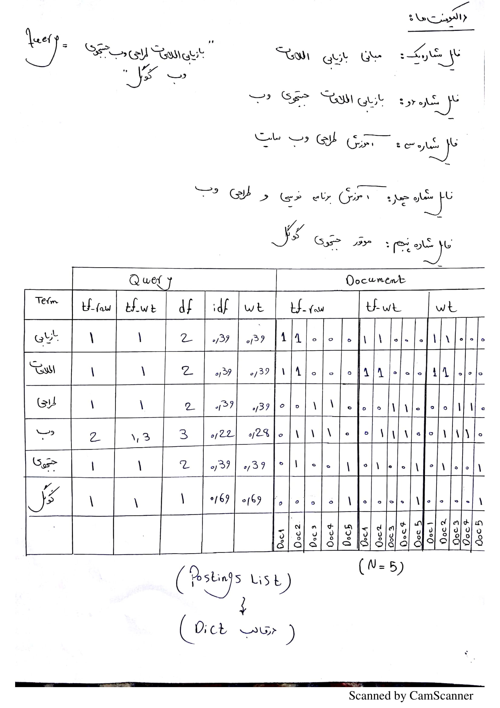
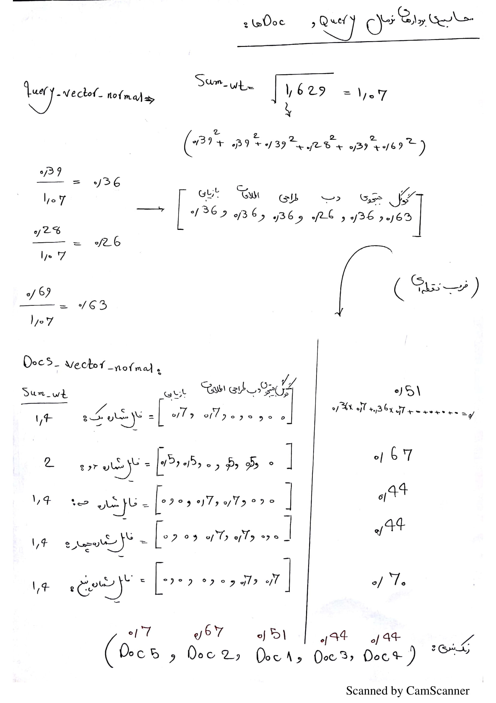

# Search Engine (LTC LNC Algorithm)
Implementation Search Engine with **LTC-LNC** algorithm and Cosine Similarity developed with Python and Flask framework

Author: M-Taghizadeh<br>
Website: [m-taghizadeh.ir](http://m-taghizadeh.ir)
<hr>

# Quick Start
- [LTC LNC ALgorithm Steps](#LTC-LNC-Algorithm-Steps) 
- [Screen Shots](#Screen-Shots)
- [Trace Algorithm](#Trace-Algorithm)
- [Dependencies](#Dependencies)
- [Routes](#Routes)


# LTC-LNC-Algorithm-Steps

- **Step1**: Tokenize query terms and remove extera space and strip query
```python
query_terms = tokenizer(query)

def tokenizer(input_str:str):
    input_str.strip()
    split_list = input_str.split(" ")
    
    tokens_list = []
    for token in split_list:
        if len(list(token)) > 1:
            tokens_list.append(token)

    return tokens_list
```

- **Step2**: Read all docs and save all doc title in documents variable
```python
documents = [f for f in os.listdir(docs_path) if f.endswith('.txt')]
```

- **Step3**: Load Postings List from database
```python
POSTINGS_LIST = {}
try:
    with open(f'{postings_path}/POSTINGS_LIST.dat', "rb") as f:
        POSTINGS_LIST = pickle.load(f)
except:
    print("we have an error for loading POSTINGS_LIST!!!")
```

- **Step4**: Create Postings list for query terms and calculate N: number of documents and create set of query terms

    ```python
    Index_Table = {}
    N = len(documents)
    Index_Table["N"] = N
    set_of_query_term = []
    ```
    
    - **Step4-A**: Calculate [tf] for query term in [Query] 
    ```python    
    for term in query_terms:

        if Index_Table.get(term):
            Index_Table[term]["query"]["tf"] += 1
        else:
            Index_Table[term] = {}
            Index_Table[term]["query"] = {}
            Index_Table[term]["query"]["tf"] = 1
            set_of_query_term.append(term)
    ```

    - **Step4-B**: Calculate [tf] for query term in [all Documents] from POSTINGS_LIST
    ```python    
    for term in query_terms:
        Index_Table[term]["document"] = {}
        for doc_title in documents:
            Index_Table[term]["document"][doc_title] = {}
            try:
                Index_Table[term]["document"][doc_title]["tf"] = POSTINGS_LIST[term][doc_title]
            except:
                Index_Table[term]["document"][doc_title]["tf"] = 0
    ```

    - **Step4-C**: Calculate [tf_wt] for query term in [Query and all Documents]
    ```python
    for term in query_terms:
        tf_query = Index_Table[term]["query"]["tf"]
        Index_Table[term]["query"]["tf_wt"] = 1 + math.log10(tf_query)

        try:
            for doc_title in Index_Table.get(term).get("document"):
                tf_document = Index_Table[term]["document"][doc_title]["tf"]
                if tf_document == 0:
                    Index_Table[term]["document"][doc_title]["tf_wt"] = 0
                else:
                    Index_Table[term]["document"][doc_title]["tf_wt"] = 1 + math.log10(tf_document)
        except: print("error")
    ```

    - **Step4-D**: Calculate [df, idf, wt] for query term in [Query] => idf = log10(N/df), wt = tf_wt * idf
    ```python    
    for term in query_terms:
        if POSTINGS_LIST.get(term):
            df = len(POSTINGS_LIST[term])
        else:
            df = 0

        Index_Table[term]["query"]["df"] = df
        if df == 0:
            Index_Table[term]["query"]["idf"] = 0
        else:
            Index_Table[term]["query"]["idf"] = math.log10(N/df)

        Index_Table[term]["query"]["wt"] = Index_Table[term]["query"]["tf_wt"] * Index_Table[term]["query"]["idf"]
    ```

    - **Step4-E**: Calculate [wt] for query term in [all Documents] => idf = 1, wt = tf_wt * idf(==1)
    ```python
    for term in query_terms:
        for doc_title in documents:
            Index_Table[term]["document"][doc_title]["wt"] = Index_Table[term]["document"][doc_title]["tf_wt"]
    ```

    - End of Calculate Index_Table
    ```python
    print("------------------------------")    
    print("Index_Table: ", Index_Table)
    print("------------------------------")
    ```

- **Step5**: Normalization of Query and goto vector space for [wt]:
    - **Step5-A**: calculate sum of wt for Query 
    ```python
    query_vector_normal = []
    sum = 0
    for term in set_of_query_term:
        sum += math.pow(Index_Table[term]["query"]["wt"], 2)
    sum = math.sqrt(sum)
    print("sum of wt for Query: ", sum)
    ```

    - **Step5-B**: calculate query_vector_normal with sum of wt 
    ```python
    for term in set_of_query_term:
        wt = Index_Table[term]["query"]["wt"]
        if sum != 0:
            query_vector_normal.append(wt / sum)
        else:
            query_vector_normal.append(0)
    print("\n\nquery_vector_normal: ", query_vector_normal, "\n\n")
    ```

- **Step6**: Normalization of all Documents and goto vector space for [wt] and save that in docs_vector_normal(as a dict)
```python
docs_vector_normal = {}
for doc_title in documents:
    docs_vector_normal[doc_title] = []

    # Step6-A: calculate sum of wt for any Document
    sum = 0
    for term in set_of_query_term:
        sum += math.pow(Index_Table[term]["document"][doc_title]["wt"], 2)
    sum = math.sqrt(sum)
    print("sum_wt: ", sum, " doc title: ", doc_title)
    
    # Step6-B: calculate docs_vector_normal[doc_title] with sum of wt for any document
    for term in set_of_query_term:
        wt = Index_Table[term]["document"][doc_title]["wt"]
        if sum != 0:
            docs_vector_normal[doc_title].append(wt / sum)
        else:
            docs_vector_normal[doc_title].append(0)
print("\n\ndocs_vector_normal: ", docs_vector_normal, "\n\n")
```

- **Step7**: Cosine Similarity => Score list 
    - **Spte7-A**: Dot Product between Query vector normal and any Documents vector normal and save that in Score list[]
    ```python
    Scores_list = []
    for doc_title in docs_vector_normal:
        doc_vector = docs_vector_normal[doc_title]
        score = 0
        for i in range(0, len(doc_vector)):
            score += doc_vector[i] * query_vector_normal[i]
        Scores_list.append([doc_title, score])
    print("Scores_list: ", Scores_list)
    ```

- **Step8**: Sorting Scores_list and get top k doc (get rankings)
```python
min = 0
for i in range(0, len(Scores_list)):
    for j in range(0, len(Scores_list)-i-1):
        if Scores_list[j][1] < Scores_list[j+1][1]:
            tmp_Scores_list = Scores_list[j]
            Scores_list[j] = Scores_list[j+1]
            Scores_list[j+1] = tmp_Scores_list
print("\n\nSorted Scores_list: ", Scores_list, "\n\n")
```

- **Step9**: get top k record from Sorted Score List (At the moment, we only return files that have a high score of zero)
```python
k = N # we suppose that k == number of docs
TOP_k_docs = []
for doc in Scores_list:
    if doc[1] != 0: # doc[1] is score of this doc
        TOP_k_docs.append(doc)
    
    if(len(TOP_k_docs) == k):
        break
    
return TOP_k_docs
```

# Screen-Shots

1. Search Engine Index Page Screen

    

2. Add or Edit Documents

    

3. Search Results Sorted with Score

    

4. Creating Posting list according to user query in each time

    

5. Posting list structure

    

6. Creating normal vector for query and all of documents for calculating **Cosine Similarity**

    


# Trace-Algorithm




# Routes
Endpoint    |   Methods  |  Rule
------------|------------|--------------------
add_doc     |   GET, POST| /add_document/
delete_doc  |    GET     | /delete_document/<string:doc_title>/
edit_doc    |    GET     | /edit_document/<string:doc_title>/
index       |    GET     | /
static      |    GET     | /static/<path:filename>


# Dependencies
- flask => webframework
- python-dotenv => for reading .env files